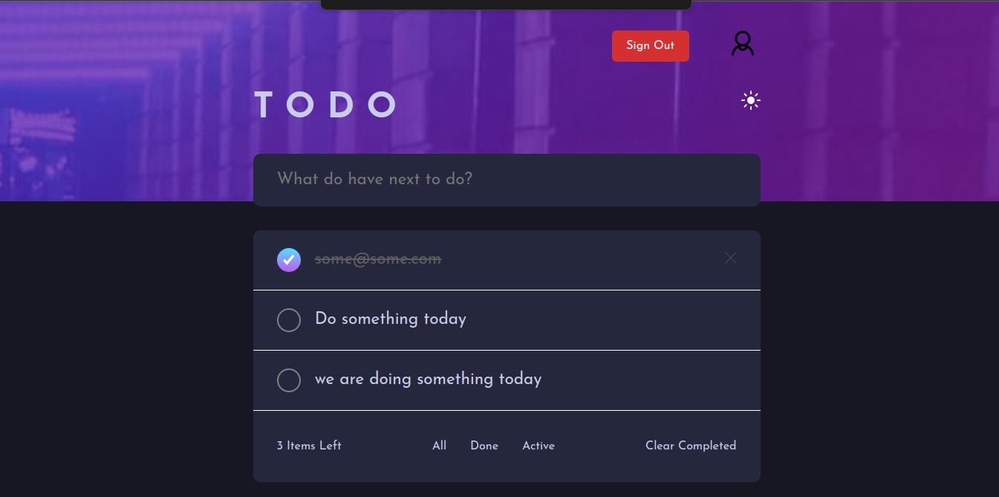

# A Todo Application Was Created For Challenge

This project was intended to have a backed with node.js and MYSQL also but problems happed on my laptop so I could not connect them and the MYSQL need to be installed again on the new system (there are more details about the problem) 

## This is now a simple to-do app useing localStorage 

